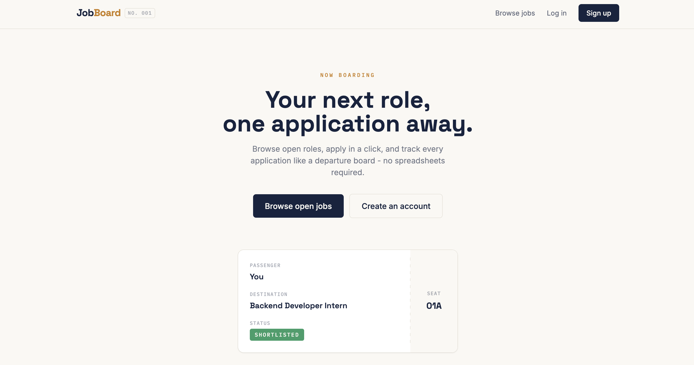
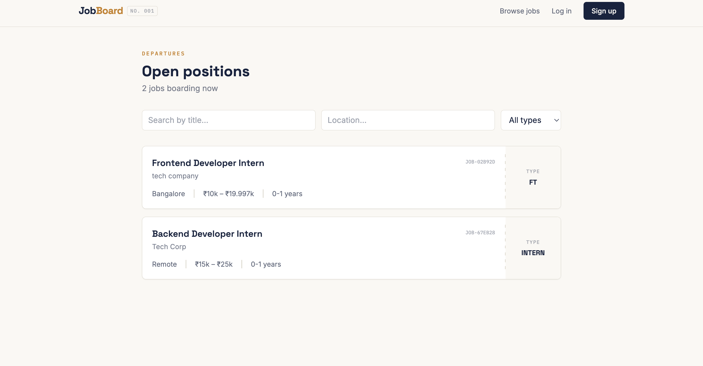
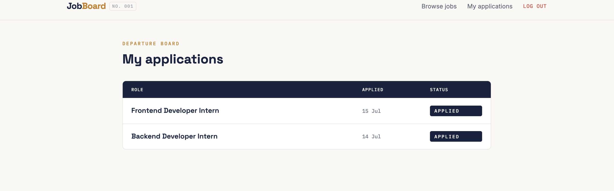
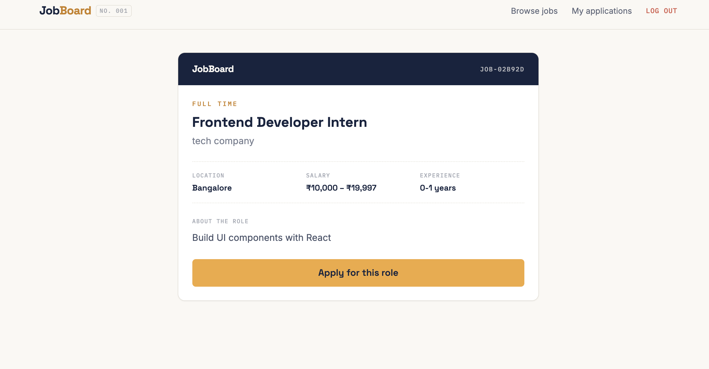

# JobBoard — MERN Job Portal

A full-stack job portal connecting students with companies, built with a distinctive boarding-pass visual theme. Students browse and apply to jobs like checking a departure board; companies post roles and track postings through a control-tower dashboard.

**Live demo:** [https://job-portal-frontend-bne6.onrender.com](https://job-portal-frontend-bne6.onrender.com)
**Backend API:** [https://job-portal-o1a4.onrender.com/api/health](https://job-portal-o1a4.onrender.com/api/health)

> Note: the backend is hosted on Render's free tier, which sleeps after 15 minutes of inactivity. The first request after a while may take 20-30 seconds to wake up.

---

## Screenshots

| Landing page                          | Job listings                    |
| ------------------------------------- | ------------------------------- |
|  |  |

| Job detail + apply                          | Student dashboard                         |
| ------------------------------------------- | ----------------------------------------- |
|  |  |

---

## Features

**For students**

- Register/login with JWT authentication
- Browse open jobs with live search and filters (title, location, job type)
- View full job details and apply in one click
- Track all applications with status badges (applied / shortlisted / rejected)

**For companies**

- Register a company account
- Post new job openings with salary range, experience level, and job type
- View all posted jobs from a dedicated dashboard

**General**

- Role-based access control (student vs company routes are protected)
- Responsive design — works on mobile and desktop
- Toast notifications, skeleton loading states, and micro-interactions throughout
- Distinctive boarding-pass/departure-board visual theme instead of a generic template

---

## Tech stack

**Frontend:** React (Vite), React Router, Tailwind CSS, Framer Motion, Axios
**Backend:** Node.js, Express, MongoDB (Atlas), Mongoose, JWT, bcrypt
**Deployment:** Render (both frontend static site and backend web service)

---

## Project structure

job-portal/
├── backend/
│ ├── config/ # MongoDB connection
│ ├── controllers/ # Route logic (auth, jobs, applications)
│ ├── middleware/ # JWT auth middleware
│ ├── models/ # Mongoose schemas (User, Job, Application)
│ ├── routes/ # Express routes
│ └── server.js
└── frontend/
└── src/
├── api/ # Axios instance
├── components/ # Navbar, JobCard, StatusBadge, skeletons
├── context/ # Auth and Toast context providers
└── pages/ # Login, Register, Jobs, JobDetail, dashboards

---

## Running locally

**Prerequisites:** Node.js, a MongoDB Atlas connection string (free tier works)

**Backend**

```bash
cd backend
cp .env.example .env   # fill in MONGO_URI and JWT_SECRET
npm install
npm run dev
```

Runs on `http://localhost:5000`

**Frontend**

```bash
cd frontend
npm install
npm run dev
```

Runs on `http://localhost:5173`

---

## API endpoints

| Method | Endpoint                            | Description                                                  | Auth required             |
| ------ | ----------------------------------- | ------------------------------------------------------------ | ------------------------- |
| POST   | `/api/auth/register`                | Register a new user                                          | No                        |
| POST   | `/api/auth/login`                   | Log in                                                       | No                        |
| GET    | `/api/jobs`                         | List jobs (supports `search`, `location`, `jobType`, `page`) | No                        |
| GET    | `/api/jobs/:id`                     | Get a single job                                             | No                        |
| POST   | `/api/jobs`                         | Post a new job                                               | Yes (company)             |
| GET    | `/api/jobs/my-jobs`                 | Get jobs posted by the logged-in company                     | Yes (company)             |
| POST   | `/api/applications`                 | Apply to a job                                               | Yes (student)             |
| GET    | `/api/applications/my-applications` | Get the logged-in student's applications                     | Yes (student)             |
| GET    | `/api/applications/job/:jobId`      | Get applicants for a job                                     | Yes (company, owner only) |

---

## Future improvements

- Resume upload via AWS S3 or Cloudinary
- Admin dashboard for platform oversight
- Email notifications on application status change
- Company view of applicants with shortlist/reject actions

---

## Author

Built by [Kavy Jain](https://github.com/kavy2005) as part of a placement-prep project sprint.
